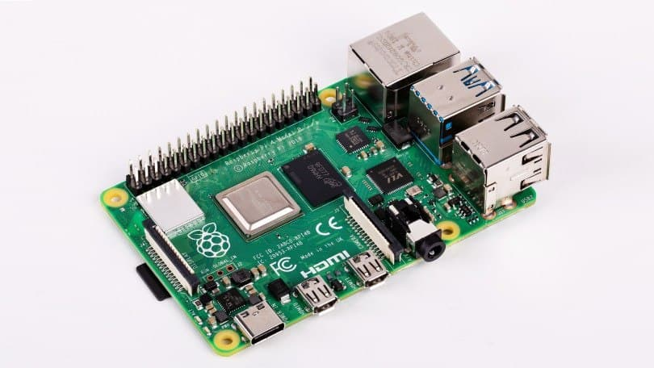

<!DOCTYPE html>
 <html lang="ru">
 <meta charset="utf-8">
 <head>
   <link rel="stylesheet" type="text/css" href="simple.css">

   

    <link rel="shortcut icon" type="text/css" href="https://avatanplus.com/files/resources/original/59bf97e55395715e946957de.png">
     <title>javamaks.site</title>
 </head>
 <body>
     
      
   		  <ul >
   		 	   <li><a href="">Главная</a></li>
   		     <li><a href="">Новости</a></li>
   		     <li><a href="">Контакты</a></li>
           <li><a href="">Адрес</a></li>
        </ul>
      
      
<h1>Начало работы с Raspberry Pi.</h1>
      <em>Raspberry Pi</em> — одноплатный компьютер размером с банковскую карту, изначально разработанный как бюджетная система для обучения информатике, но позже получивший более широкое применение и известность. Разрабатывается британской компанией Raspberry Pi Foundation во главе с Эбеном Аптоном. По состоянию на конец 2019 года было продано более 30 миллионов устройств Raspberry Pi.
      В первой части были рассмотрены 5 способов использования Raspberry Pi. Тема оказалась достаточно интересной, и сегодня я рассмотрю еще несколько вариантов того, как можно с пользой использовать этот микрокомпьютер
      В марте семнадцатого основатель Raspberry Pi Fondation Эбен Кристофер Аптон объявил, что за пять лет существования проекта было продано 12,5 миллионов одноплатников. Платформа обогнала  легендарного старичка Commodore 64 и заняла третье место по продажам среди компьютеров общего назначения. До PC и Apple «Малине» ещё очень и очень далеко, но для железки, которая по первоначальному бизнес-плану должна была продаться тиражом 10 000 экземпляров, успех невероятный.
      Разумеется, такая популярная плата, да ещё и долгое время продававшаяся по принципу «одна штука в одни руки», обросла кучей легенд и мифов. И сегодня мы разберём самые популярные из них.
      
<h2>Для работы с Raspberry Pi нужно установить OS</h2>

      
      Для установки операционной системы на Paspberry Pi нам понадобиться:
      <ol>
  <li>Micro SD карта(8GB,16GB,32GB)</li>
  <li>Скачать образ операционной системы Raspberry OS(Linux)</li>
  <li>Скачать утилиту для загрузки образа на Micro SD(BalenaEtcher) </li>
  <li>Базовая настройка операционной системы</li>
</ol>
      

    
         

      
      
    

 </body>
 <footer> </footer>

&#128386; Жавохир Абдуманнонов.Сайт создан на чистом энтузиазме 

 </html>
